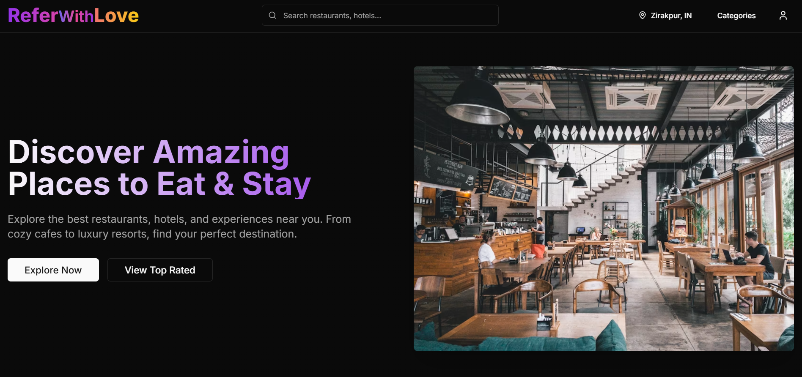

   
    <a href="https://myphone-nine.vercel.app/
" target="_blank">
      "
    </a>
   

  

# 1️⃣ Clone this repository
git clone https://github.com/your-username/explore-food.git

# 2️⃣ Install dependencies
npm install

# 3️⃣ Start the development server
npm run dev
